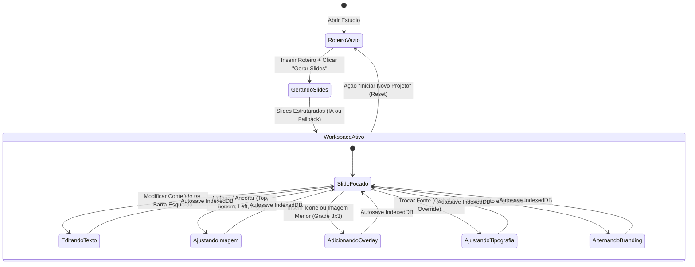

# Data Model & State Architecture: Carousel Studio Workspace

**Feature**: `002-carousel-workspace-editor`  
**Date**: 2026-09-05  
**Spec**: [spec.md](file:///D:/Carrosseis-Generator/specs/002-carousel-workspace-editor/spec.md)

---

## 1. Visão Geral e Filosofia de Estado (KISS & Clean Architecture)

Em total conformidade com a Constituição do projeto (Princípio I e II), o modelo de dados opera como **estruturas puras de dados em JavaScript (Plain JavaScript Objects - POJOs)**, desacopladas de frameworks e bibliotecas visuais. Toda a persistência é assíncrona e serializável diretamente no IndexedDB do navegador.

---

## 2. Entidades Centrais e Tipagem Estruturada

### 2.1. `WorkspaceState` (Estado Global do Estúdio)

Representa a sessão ativa do usuário no espaço de trabalho.

```javascript
/**
 * @typedef {Object} WorkspaceState
 * @property {string} id - Identificador único da sessão/projeto (ex: "proj-1725540000000")
 * @property {string} title - Título ou tema do carrossel
 * @property {string} rawScript - Roteiro bruto inserido pelo usuário
 * @property {string} activeSlideId - ID do slide atualmente em foco/edição na barra lateral
 * @property {string} globalFont - Família tipográfica padrão de todos os slides (ex: "Inter", "Playfair Display")
 * @property {string} currentTheme - Tema visual ativo (ex: "abyssal-glow", "light-clean", "minimalist")
 * @property {string} platform - Proporção de tela selecionada ("instagram-1-1", "instagram-4-5", "tiktok-9-16", "linkedin-pdf")
 * @property {CreatorProfile} profile - Credenciais de autoria do criador
 * @property {Array<SlideItem>} slides - Coleção ordenada dos slides do carrossel
 * @property {boolean} isGenerating - Flag indicativa de processamento de IA/geração
 * @property {number} lastModified - Timestamp epoch da última alteração para autosave
 */
```

---

### 2.2. `SlideItem` (Quadro Individual do Carrossel)

Representa cada slide individual renderizado no palco e editado pela barra lateral esquerda.

```javascript
/**
 * @typedef {Object} SlideItem
 * @property {string} id - Identificador único do slide (ex: "slide-1", "slide-2")
 * @property {number} order - Posição ordinal na sequência (1-indexed)
 * @property {string} type - Tipo de slide ("cover", "content", "cta")
 * @property {string} content - Texto principal do slide (título, corpo ou chamada para ação)
 * @property {string|null} fontOverride - Fonte customizada opcional para este slide (null se herdar globalFont)
 * @property {boolean} showBranding - Controle de visibilidade da foto e @handle neste slide (true = visível, false = oculto)
 * @property {DockedImage|null} dockedImage - Configuração da imagem principal do slide (ou null se não houver)
 * @property {Array<OverlayItem>} overlays - Lista de ícones ou imagens menores adicionais sobrepostos
 */
```

---

### 2.3. `DockedImage` (Imagem Principal de Ancoragem Estruturada)

Representa a imagem de destaque inserida no slide com ancoragem em 4 modos.

```javascript
/**
 * @typedef {Object} DockedImage
 * @property {string} src - URL ou representação Base64 da imagem
 * @property {number} scale - Fator de escala/zoom (de 0.5 a 2.0, padrão: 1.0)
 * @property {'top' | 'bottom' | 'left' | 'right'} position - Modo de ancoragem estruturada no slide
 *   - 'top': Imagem no topo, texto abaixo
 *   - 'bottom': Texto no topo, imagem na base
 *   - 'left': Layout dividido (Split): imagem na metade esquerda, texto na metade direita
 *   - 'right': Layout dividido (Split): texto na metade esquerda, imagem na metade direita
 */
```

---

### 2.4. `OverlayItem` (Ícone ou Imagem Menor Secundária)

Representa elementos gráficos de apoio posicionados sobre o slide através da matriz de 9 âncoras.

```javascript
/**
 * @typedef {Object} OverlayItem
 * @property {string} id - Identificador único do overlay (ex: "overlay-icon-star-1")
 * @property {'icon' | 'image'} type - Tipo do elemento gráfico
 * @property {string} iconName - Nome do ícone da biblioteca (ex: "Sparkles", "ArrowRight", "Flame") ou URL/Base64 se imagem
 * @property {number} size - Tamanho em pixels (entre 24 e 180, padrão: 48)
 * @property {GridAnchor} anchor - Região de fixação na grade de 9 pontos
 * @property {string} [color] - Cor do ícone vetorial (padrão: herda o destaque do tema ou var(--accent))
 */

/**
 * @typedef {'top-left' | 'top-center' | 'top-right' |
 *           'center-left' | 'center' | 'center-right' |
 *           'bottom-left' | 'bottom-center' | 'bottom-right'} GridAnchor
 */
```

---

### 2.5. `CreatorProfile` (Identidade do Criador)

Dados de atribuição e marca pessoal com persistência independente.

```javascript
/**
 * @typedef {Object} CreatorProfile
 * @property {string} name - Nome completo de exibição do autor
 * @property {string} handle - Identificador nas redes sociais (ex: "@criador.digital")
 * @property {string|null} avatar - Foto de perfil em Base64 ou URL
 * @property {'top' | 'bottom'} position - Posição padrão da barra de assinatura nos slides
 */
```

---

## 3. Catálogo Curado de Tipografia e Ícones

```javascript
export const AVAILABLE_FONTS = [
  { id: 'Inter', name: 'Inter (Moderno & Neutro)', category: 'sans-serif' },
  { id: 'Plus Jakarta Sans', name: 'Plus Jakarta Sans (Elegante & Clean)', category: 'sans-serif' },
  { id: 'Playfair Display', name: 'Playfair Display (Editorial & Sofisticado)', category: 'serif' },
  { id: 'Space Grotesk', name: 'Space Grotesk (Tech & Impactante)', category: 'display' },
  { id: 'Montserrat', name: 'Montserrat (Forte & Marcante)', category: 'sans-serif' }
];

export const CURATED_ICONS = [
  { id: 'Sparkles', label: 'Destaque / IA' },
  { id: 'Flame', label: 'Fogo / Tendência' },
  { id: 'Rocket', label: 'Foguete / Crescimento' },
  { id: 'Lightbulb', label: 'Ideia / Dica' },
  { id: 'CheckCircle', label: 'Concluído / Vantagem' },
  { id: 'ArrowRight', label: 'Seta de Deslize' },
  { id: 'Quote', label: 'Citação' },
  { id: 'Star', label: 'Estrela / Avaliação' },
  { id: 'Heart', label: 'Curtida / Empatia' },
  { id: 'AlertCircle', label: 'Atenção / Alerta' }
];
```

---

## 4. Diagrama de Transição de Estado do Espaço de Trabalho


