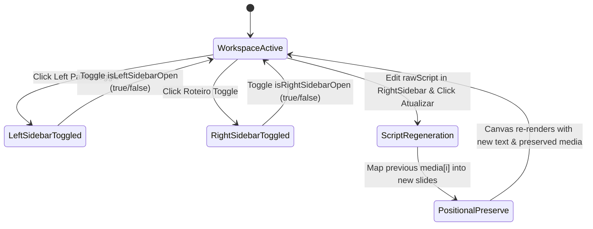

# Data Model: Slide Templates, Subtext, Enhanced Branding & Studio Layout Refinement

**Feature**: `003-slide-templates-branding`
**Status**: Completed (Refined 2026-09-06)

## 1. Entities & Schemas

### 1.1 `CreatorProfile` (Enhanced)
Represents the author identity displayed on carousel slides and configured in the LeftSidebar Branding tab.

```typescript
interface CreatorProfile {
  name: string;                         // Creator's display name
  handle: string;                       // Creator's @handle
  avatarUrl: string | null;             // Base64 or URL to avatar image
  hasVerifiedBadge: boolean;            // Displays celestial verified badge if true (Default: false)
  avatarShape: 'circle' | 'square';     // Avatar geometric contour ('circle' | 'square', Default: 'circle')
}
```

**Validation Rules**:
- `name`: Max 60 characters; trims leading/trailing whitespace.
- `handle`: Max 30 characters; sanitized to ensure `@` prefix.
- `hasVerifiedBadge`: Boolean primitive (`true` | `false`).
- `avatarShape`: Must be strictly `'circle'` or `'square'`.

---

### 1.2 `Slide` (Enhanced)
Represents an individual slide within the carousel sequence.

```typescript
interface Slide {
  id: string;                                                      // Unique slide UUID
  order: number;                                                   // 1-based index in carousel sequence
  content: string;                                                 // Core headline / main narrative
  subtext?: string;                                                // Secondary hierarchical supporting text (Default: '')
  slideTemplate?: 'classic' | 'quote' | 'minimalist';              // Curated 3 layout templates (Default: 'classic')
  dockedImage?: { src: string; position: string; scale: number } | null; // Docked media
  overlays?: Array<OverlayElement>;                                // Overlays array
  fontOverride?: string | null;                                    // Optional per-slide font
  showBranding?: boolean;                                          // Author signature visibility
}
```

**Validation Rules**:
- `subtext`: Optional string, max 280 characters. If empty or whitespace-only, renders nothing without residual margin.
- `slideTemplate`: Must be strictly one of `'classic'`, `'quote'`, `'minimalist'`. Defaults to `'classic'`.
- `dockedImage`, `overlays`: Positional media preserved across raw script bulk regenerations.

---

### 1.3 `CarouselWorkspace` (Enhanced with Dual Sidebars)
Root state holding the active carousel project.

```typescript
interface CarouselWorkspace {
  id: string;                           // Workspace ID
  title: string;                        // Carousel project title
  rawScript: string;                    // Full raw script text accessible/editable in RightSidebar
  currentTheme: string;                 // Theme ID ('abyssal-glow' | 'celestial-azure' | 'clean-ivory' | 'clean-slate' | etc.)
  activeSlideId: string | null;         // Selected slide ID
  slides: Slide[];                      // Sequential list of slides
  profile: CreatorProfile;              // Creator branding
  globalFont: string;                   // Global font family
  isLeftSidebarOpen: boolean;           // NEW: Visibility state of Left Sidebar (Default: true)
  isRightSidebarOpen: boolean;          // NEW: Visibility state of Right Sidebar (Default: false)
  lastModified: number;                 // Timestamp of last change
}
```

---

### 1.4 `ThemeDefinition` (Curated with Clean Themes & Celestial Blue)

```typescript
interface ThemeDefinition {
  id: string;                           // Canonical theme ID
  name: string;                         // User-facing display name
  preview: string;                      // Color hex for UI palette selector
  category: 'clean' | 'bioluminescent' | 'vibrant' | 'dark'; // Category grouping
}
```

**Curated Theme Registry**:
1. `abyssal-glow`: Deep bioluminescent cyan & dark emerald (`#05ffd4`).
2. `celestial-azure`: Radiant celestial blue gradient (`#00A3FF` / `#00D2FF`).
3. `clean-ivory`: Warm editorial cream (`#FAF8F5`) with charcoal text and subtle borders.
4. `clean-slate`: High-end Scandinavian clean dark (`#0E1117`).
5. `light-clean`: Daylight clean with vivid sky blue accents (`#00A3FF`).
6. `minimalist-obsidian`: Stark dark focus with crisp monochrome borders.
7. `sunset-nebula`: Radiant dusk gradient with magenta/rose tones.
8. `reference-aesthetic`: Extensible palette slot for user reference image.

---

## 2. State Transitions & Lifecycle

### 2.1 Dual-Sidebar Workspace Layout

