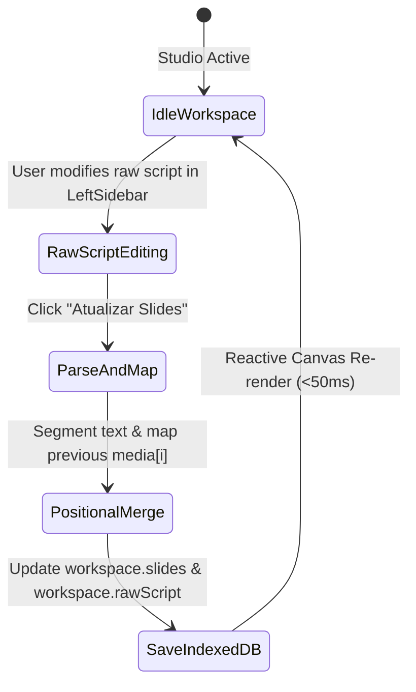

# Data Model: Slide Templates, Subtext, Enhanced Branding & Clean Themes

**Feature**: `003-slide-templates-branding`
**Status**: Completed

## 1. Entities & Schemas

### 1.1 `CreatorProfile` (Enhanced)
Represents the author identity displayed on carousel slides and configured in the LeftSidebar Branding tab.

```typescript
interface CreatorProfile {
  name: string;                         // Creator's display name
  handle: string;                       // Creator's @handle
  avatarUrl: string | null;             // Base64 or URL to avatar image
  hasVerifiedBadge: boolean;            // NEW: Displays celestial verified badge if true (Default: false)
  avatarShape: 'circle' | 'square';     // NEW: Avatar geometric contour ('circle' | 'square', Default: 'circle')
}
```

**Validation Rules**:
- `name`: Max 60 characters; trims leading/trailing whitespace.
- `handle`: Max 30 characters; sanitized to ensure `@` prefix.
- `hasVerifiedBadge`: Boolean primitive (`true` | `false`).
- `avatarShape`: Must be strictly `'circle'` or `'square'`.

---

### 1.2 `Slide` (Enhanced)
Represents an individual slide within the carousel sequence.

```typescript
interface Slide {
  id: string;                                                      // Unique slide UUID
  order: number;                                                   // 1-based index in carousel sequence
  title: string;                                                   // Main hook/title
  body: string;                                                    // Core body narrative
  subtext?: string;                                                // NEW: Secondary hierarchical supporting text (Default: '')
  slideTemplate?: 'classic' | 'quote' | 'bullets' | 'stat' | 'minimalist'; // NEW: Layout template (Default: 'classic')
  dockedImage?: string | null;                                     // Base64 image payload or null
  imagePosition?: 'top' | 'bottom' | 'left' | 'right' | 'none';    // Split docking orientation
  splitRatio?: number;                                             // Percentage allocated to image (20-80)
  overlays?: (OverlayElement | null)[];                            // 9-slot anchor grid array
}
```

**Validation Rules**:
- `subtext`: Optional string, max 280 characters. If empty or whitespace-only, renders nothing.
- `slideTemplate`: Must be one of `'classic'`, `'quote'`, `'bullets'`, `'stat'`, `'minimalist'`. Defaults to `'classic'`.
- `dockedImage`, `imagePosition`, `splitRatio`, `overlays`: Positional media preserved across raw script regenerations.

---

### 1.3 `CarouselWorkspace` (Enhanced)
Root state holding the active carousel project.

```typescript
interface CarouselWorkspace {
  id: string;                           // Workspace ID
  title: string;                        // Carousel project title
  rawScript: string;                    // NEW: Full raw script text accessible/editable in LeftSidebar
  themeId: string;                      // Theme ID ('abyssal-glow' | 'clean-ivory' | 'clean-slate' | 'celestial-azure' | etc.)
  activeSlideIndex: number;             // Zero-based index of currently selected slide
  slides: Slide[];                      // Sequential list of slides
  branding: CreatorProfile;             // Creator branding
  typography: {
    fontFamily: string;                 // Selected font family
    titleSize: number;                  // Font size multiplier for title
    bodySize: number;                   // Font size multiplier for body
  };
  updatedAt: number;                    // Timestamp of last change
}
```

---

### 1.4 `ThemeDefinition` (Enhanced with Clean Themes & Celestial Blue)

```typescript
interface ThemeDefinition {
  id: string;                           // Canonical theme ID
  name: string;                         // User-facing display name
  preview: string;                      // Color hex for UI palette selector
  category: 'clean' | 'bioluminescent' | 'vibrant' | 'dark'; // NEW: Category filter/grouping
  cssVariables: {
    '--slide-bg': string;
    '--slide-text': string;
    '--slide-heading': string;
    '--slide-accent': string;
    '--slide-subtext': string;
    '--slide-border': string;
    '--slide-tag-bg': string;
  };
}
```

**Curated Theme Registry**:
1. `abyssal-glow`: Deep bioluminescent cyan & dark emerald (`#05ffd4`).
2. `clean-ivory`: Minimalist warm editorial cream (`#FAF8F5`) with charcoal text and subtle celestial accents (`#FAF8F5`).
3. `clean-slate`: High-end Scandinavian dark clean (`#0E1117`) with crisp celestial azure highlights (`#00A3FF`).
4. `celestial-azure`: Radiant celestial blue sky gradient (`#00A3FF` / `#00D2FF`) with vivid glowing aura.
5. `light-clean`: Updated clean daylight with vibrant celestial blue accents (`#00A3FF`).
6. `minimalist-obsidian`: Stark dark focus with crisp monochrome borders.
7. `sunset-nebula`: Radiant dusk gradient with magenta/rose tones.
8. `reference-editorial`: Extensible palette slot configured for user-supplied reference images.

---

## 2. State Transitions & Lifecycle

### 2.1 Raw Script Bulk Regeneration Workflow


### 2.2 Branding Toggle Transitions
- `toggleVerifiedBadge()`: Toggles `hasVerifiedBadge` (`false` ↔ `true`) → Dispatches reactive update to `branding` → Immediate visual badge indicator update.
- `setAvatarShape('circle' | 'square')`: Updates `avatarShape` → Immediate CSS class toggle (`rounded-full` ↔ `rounded-xl`) with smooth transition.

### 2.3 Slide Template Transitions
- `setSlideTemplate(slideId, templateId)`: Updates active slide `slideTemplate`.
- `applyTemplateToAll(templateId)`: Pure map over all `slides`, updating `slideTemplate` uniformly without touching text or media.
