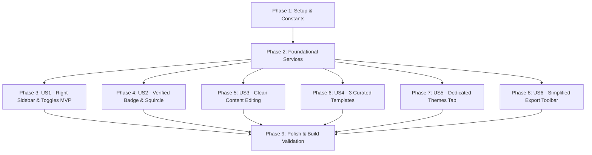

# Tasks: Slide Templates, Subtext, Enhanced Creator Branding & Studio Layout Refinement

**Input**: Design documents from `specs/003-slide-templates-branding/`
**Prerequisites**: [plan.md](file:///D:/Carrosseis-Generator/specs/003-slide-templates-branding/plan.md), [spec.md](file:///D:/Carrosseis-Generator/specs/003-slide-templates-branding/spec.md), [research.md](file:///D:/Carrosseis-Generator/specs/003-slide-templates-branding/research.md), [data-model.md](file:///D:/Carrosseis-Generator/specs/003-slide-templates-branding/data-model.md), [contracts/](file:///D:/Carrosseis-Generator/specs/003-slide-templates-branding/contracts/)

## Format: `- [ ] [TaskID] [P?] [Story?] Description with file path`

- **[P]**: Can run in parallel (different files, no dependencies)
- **[Story]**: Which user story this task belongs to ([US1], [US2], [US3], [US4], [US5], [US6])
- Strict file paths included in all descriptions

---

## Phase 1: Setup (Shared Infrastructure & Design Tokens)

**Purpose**: Theme constants, template definitions (3 curated layouts), and dual-sidebar CSS layout

- [ ] T001 Register updated `SLIDE_TEMPLATES` (strictly 3 templates: `classic`, `quote`, `minimalist`) in `src/services/workspaceConstants.js`
- [ ] T002 [P] Configure CSS variables for Celestial Blue (`--slide-heading: #00D2FF`, `--slide-accent: #00A3FF`), Clean Ivory, and Scandinavian Slate in `src/styles/themes.css`
- [ ] T003 [P] Configure CSS styles for dual collapsible sidebar drawers, edge toggle buttons, and 3 template layouts in `src/styles/workspace.css`

---

## Phase 2: Foundational (Blocking Services & Data Compatibility)

**Purpose**: Pure function validators and storage migration defaults

**⚠️ CRITICAL**: Must be completed before user story UI implementation begins

- [ ] T004 Ensure `workspaceService.js` restricts template updates strictly to `'classic'`, `'quote'`, `'minimalist'` and preserves media posicionalmente
- [ ] T005 [P] Update storage schema rehydration in `src/services/storageService.js` with defaults for `isLeftSidebarOpen` and `isRightSidebarOpen`

**Checkpoint**: Foundation ready - user story implementation can begin independently

---

## Phase 3: User Story 1 - Dedicated Right Sidebar for Raw Script & Sidebar Toggles (Priority: P1) 🎯 MVP

**Goal**: Criador pode visualizar e editar o roteiro completo em uma gaveta lateral direita dedicada com botão de atualização em lote, e pode ocultar/exibir ambas as barras laterais para maximizar o canvas.

**Independent Test**: Abrir a barra lateral direita pelo botão de toggle, colar um novo roteiro, clicar em "Atualizar Slides pelo Roteiro" e verificar a reconstrução dos slides no palco central; depois, recolher ambas as barras e verificar expansão total do canvas.

### Implementation for User Story 1

- [ ] T006 [P] [US1] Create `src/components/RightSidebar/RightSidebar.jsx` with full script textarea, word/character counter, and bulk update action
- [ ] T007 [US1] Remove raw script tab from `src/components/LeftSidebar/LeftSidebar.jsx` (relocated to right sidebar)
- [ ] T008 [US1] Implement independent toggle buttons and state (`isLeftSidebarOpen`, `isRightSidebarOpen`) in `src/components/StudioWorkspace.jsx`
- [ ] T009 [US1] Connect raw script bulk regeneration handler and responsive canvas adjustment in `src/components/StudioWorkspace.jsx`

**Checkpoint**: User Story 1 provides ergonomic full-width editing with independent collapsible sidebars.

---

## Phase 4: User Story 2 - Enhanced Creator Branding: Verified Badge & Squircle Avatar (Priority: P1)

**Goal**: Criador pode ativar o selo verificado com destaque bioluminescente ao lado do nome e escolher formato da foto entre redonda e quadrada (squircle).

**Independent Test**: Na aba Perfil da barra esquerda, ativar o switch "Selo Verificado" e alternar o seletor entre "Redonda" e "Quadrada", confirmando visualmente a insígnia azul celestial ao lado do nome e a curvatura suave do avatar.

### Implementation for User Story 2

- [ ] T010 [P] [US2] Verify toggle for `hasVerifiedBadge` and avatar shape selector (circle vs squircle) in `src/components/LeftSidebar/BrandingTab.jsx`
- [ ] T011 [US2] Verify bioluminescent verified badge and squircle avatar class binding in `src/components/SlideCard.jsx`

**Checkpoint**: User Story 2 operates smoothly with persistent local state.

---

## Phase 5: User Story 3 - Clean Slide Content Editing (No "Tipo de Slide") & Subtext (Priority: P1)

**Goal**: Criador edita texto principal e subtexto independente com hierarquia tipográfica clara e sem a distração do seletor técnico de tipo de slide.

**Independent Test**: Abrir a aba Slide da barra esquerda, confirmar que o dropdown de "Tipo de Slide" foi removido, preencher o subtexto e constatar que ele é exibido perfeitamente subordinado ao texto principal.

### Implementation for User Story 3

- [ ] T012 [P] [US3] Remove "Tipo de Slide" dropdown from `src/components/LeftSidebar/SlideContentTab.jsx`, keeping only Main Text, Subtext, and organization actions
- [ ] T013 [US3] Verify `
` rendering with hierarchical typography and no ghost spacing in `src/components/SlideCard.jsx`

**Checkpoint**: User Story 3 eliminates clutter and delivers crisp content editing.

---

## Phase 6: User Story 4 - Curated 3 High-Fidelity Slide Templates (Priority: P1)

**Goal**: Criador pode selecionar entre os 3 templates visuais estáveis (*Cartão Clássico*, *Citação Editorial*, *Minimalista Foco*) para o slide ativo ou aplicar a todos.

**Independent Test**: Alternar entre os 3 templates na aba Slide e verificar que cada um adota com perfeição sua estilização visual (aspas estilizadas na citação, respiro no minimalista, equilíbrio no clássico).

### Implementation for User Story 4

- [ ] T014 [P] [US4] Update template selector in `src/components/LeftSidebar/SlideContentTab.jsx` to render exactly the 3 curated templates (*Classic, Quote, Minimalist*)
- [ ] T015 [US4] Streamline template rendering in `src/components/SlideCard.jsx` to support the 3 curated templates with high visual fidelity
- [ ] T016 [US4] Verify "Aplicar este template a todos os slides" uniformly applies across all slides in `src/components/StudioWorkspace.jsx`

**Checkpoint**: User Story 4 delivers 100% reliable layout variations without broken list/stat parsing.

---

## Phase 7: User Story 5 - Dedicated Color Palette & Themes Tab (Priority: P1)

**Goal**: Criador possui uma aba exclusiva na barra lateral esquerda dedicada a Cores & Temas Visuais, desacoplada da aba de Fontes.

**Independent Test**: Clicar na nova aba "Cores" da barra esquerda e escolher "Azul Celestial" e "Clean Ivory"; clicar na aba "Fontes" e constatar que contém apenas opções tipográficas.

### Implementation for User Story 5

- [ ] T017 [P] [US5] Create dedicated `src/components/LeftSidebar/ThemesTab.jsx` with visual theme cards, categories, and active indicator
- [ ] T018 [US5] Add `themes` tab with Palette icon to `src/components/LeftSidebar/LeftSidebar.jsx` and decouple color palette picker from `src/components/LeftSidebar/TypographyTab.jsx`
- [ ] T019 [US5] Connect theme selection in `src/components/StudioWorkspace.jsx` and verify *Azul Celestial*, *Clean Ivory*, and *Scandinavian Slate*

**Checkpoint**: User Story 5 provides clean separation between typography and color palettes.

---

## Phase 8: User Story 6 - Simplified Export Toolbar (PNGs ZIP Only) (Priority: P2)

**Goal**: Criador baixa o carrossel em imagens PNG de alta resolução agrupadas em ZIP com um único clique, sem botões de PDF poluindo a barra.

**Independent Test**: Observar a barra de exportação no topo direito do palco e confirmar a presença exclusiva do botão "Baixar PNGs (ZIP)".

### Implementation for User Story 6

- [ ] T020 [P] [US6] Remove PDF export button and handlers from `src/components/ExportToolbar.jsx`, keeping exclusively "Baixar PNGs (ZIP)"
- [ ] T021 [US6] Verify export layout and clean header presentation in `src/components/ExportToolbar.jsx`

**Checkpoint**: User Story 6 provides a clean, single-action export experience.

---

## Phase 9: Polish & Cross-Cutting Concerns

**Purpose**: Build validation, E2E verification, and code cleanup

- [ ] T022 [P] Verify production build and asset bundling via `cmd /c "npm run build"`
- [ ] T023 Execute all 8 validation scenarios defined in `specs/003-slide-templates-branding/quickstart.md`
- [ ] T024 Code cleanup, comment integrity check, and documentation synchronization

---

## Dependencies & Execution Order

### Phase Dependencies

### User Story Dependencies
- **User Story 1 (P1)**: Can start after Phase 2. Core layout MVP.
- **User Stories 2 to 6**: Can proceed in parallel once Phase 2 is complete.

---

## Implementation Strategy

### MVP First (User Story 1 Focus)
1. Complete **Phase 1** (Constants & CSS: T001-T003).
2. Complete **Phase 2** (Foundational Services: T004-T005).
3. Complete **Phase 3** (Right Sidebar & Toggles: T006-T009).
4. **VALIDATE MVP**: Test right sidebar bulk editing and sidebar collapse/expand.

### Incremental Delivery of Refinements
5. Implement **Phase 4** (Verified Badge & Squircle: T010-T011).
6. Implement **Phase 5** (Clean Content Editing: T012-T013).
7. Implement **Phase 6** (3 Curated Templates: T014-T016).
8. Implement **Phase 7** (Dedicated Themes Tab: T017-T019).
9. Implement **Phase 8** (Simplified Export: T020-T021).
10. Execute **Phase 9** (Build & E2E Validation: T022-T024).
