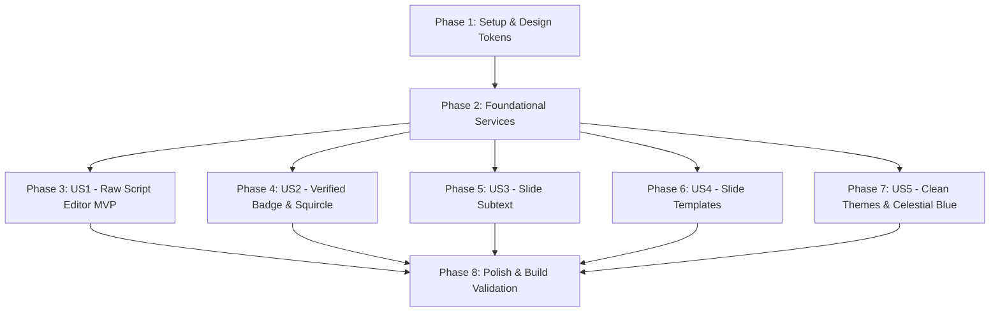

# Tasks: Slide Templates, Subtext, Enhanced Creator Branding & Clean Themes

**Input**: Design documents from `specs/003-slide-templates-branding/`
**Prerequisites**: [plan.md](file:///D:/Carrosseis-Generator/specs/003-slide-templates-branding/plan.md), [spec.md](file:///D:/Carrosseis-Generator/specs/003-slide-templates-branding/spec.md), [research.md](file:///D:/Carrosseis-Generator/specs/003-slide-templates-branding/research.md), [data-model.md](file:///D:/Carrosseis-Generator/specs/003-slide-templates-branding/data-model.md), [contracts/](file:///D:/Carrosseis-Generator/specs/003-slide-templates-branding/contracts/)

## Format: `- [x] [TaskID] [P?] [Story?] Description with file path`

- **[P]**: Can run in parallel (different files, no dependencies)
- **[Story]**: Which user story this task belongs to ([US1], [US2], [US3], [US4], [US5])
- Strict file paths included in all descriptions

---

## Phase 1: Setup (Shared Infrastructure & Design Tokens)

**Purpose**: Theme constants, template identifiers, and CSS token initialization

- [x] T001 Register new theme definitions, template IDs, and constants in `src/services/workspaceConstants.js`
- [x] T002 Configure CSS variables for Celestial Blue (`--slide-heading: #00D2FF`, `--slide-accent: #00A3FF`), Clean Ivory, and Scandinavian Slate in `src/styles/themes.css`
- [x] T003 [P] Configure base CSS classes and layout mixins for template variants, squircle avatars, and verified badges in `src/styles/workspace.css`

---

## Phase 2: Foundational (Blocking Services & Data Compatibility)

**Purpose**: Core pure functions and storage migration defaults required by all user stories

**⚠️ CRITICAL**: Must be completed before user story UI implementation begins

- [x] T004 Implement pure functional `regenerateSlidesFromRawScript` with positional media preservation in `src/services/workspaceService.js`
- [x] T005 [P] Implement branding updater `updateCreatorBranding` and template updaters (`updateSlideTemplate`, `applyTemplateToAllSlides`) in `src/services/workspaceService.js`
- [x] T006 [P] Update storage schema rehydration with safe defaults for `subtext`, `slideTemplate`, `hasVerifiedBadge`, `avatarShape`, and `rawScript` in `src/services/storageService.js`

**Checkpoint**: Foundation ready - user story implementation can begin independently

---

## Phase 3: User Story 1 - Bulk Raw Script LeftSidebar Editor & Regeneration (Priority: P1) 🎯 MVP

**Goal**: Criador pode visualizar, editar ou colar um novo roteiro completo na barra lateral e regenerar todos os slides de uma vez com preservação posicional de mídias.

**Independent Test**: Abrir a aba de Roteiro na barra lateral esquerda, colar um novo texto com múltiplos blocos, clicar em "Atualizar Slides pelo Roteiro" e verificar que todos os slides são reconstruídos no palco preservando imagens ancoradas e overlays nos índices correspondentes.

### Implementation for User Story 1

- [x] T007 [P] [US1] Create full raw script editor component with character count and regenerate action in `src/components/LeftSidebar/RawScriptTab.jsx`
- [x] T008 [US1] Integrate `RawScriptTab` navigation item and icon into `src/components/LeftSidebar/LeftSidebar.jsx`
- [x] T009 [US1] Connect raw script bulk regeneration handler and state sync in `src/components/StudioWorkspace.jsx`
- [x] T010 [US1] Verify positional media preservation and edge case error handling on bulk regeneration in `src/components/StudioWorkspace.jsx`

**Checkpoint**: User Story 1 is fully functional and testable independently as the core MVP increment.

---

## Phase 4: User Story 2 - Enhanced Creator Branding: Verified Badge & Squircle Avatar (Priority: P1)

**Goal**: Criador pode ativar o selo verificado com destaque bioluminescente ao lado do nome e escolher formato da foto entre redonda e quadrada (squircle).

**Independent Test**: Na aba de Branding da barra lateral esquerda, ativar o switch "Selo Verificado" e alternar o seletor entre "Redonda" e "Quadrada", confirmando visualmente no rodapé/cabeçalho dos slides a renderização do selo azul celeste e a curvatura suave do avatar.

### Implementation for User Story 2

- [x] T011 [P] [US2] Add verified badge toggle switch and avatar shape selector (circle vs squircle) in `src/components/LeftSidebar/BrandingTab.jsx`
- [x] T012 [US2] Implement verified badge SVG/icon rendering and squircle (`rounded-xl`) avatar class binding in `src/components/SlideCard.jsx`
- [x] T013 [US2] Wire branding updates to workspace state and verify instant reactive update (<50ms) in `src/components/StudioWorkspace.jsx`

**Checkpoint**: User Stories 1 and 2 operate independently with persistent local state.

---

## Phase 5: User Story 3 - Hierarchical Subtext per Slide (Priority: P1)

**Goal**: Criador pode adicionar um subtexto independente em cada slide para estabelecer hierarquia tipográfica clara entre título e apoio.

**Independent Test**: Selecionar um slide, digitar um subtexto no campo correspondente da barra lateral esquerda e verificar que o slide exibe o título em destaque e o subtexto imediatamente abaixo com tipografia refinada e sem espaçamento fantasma quando vazio.

### Implementation for User Story 3

- [x] T014 [P] [US3] Add subtext input textarea with character counter in `src/components/LeftSidebar/SlideContentTab.jsx`
- [x] T015 [US3] Render `
` conditionally with hierarchical typography in `src/components/SlideCard.jsx`
- [x] T016 [US3] Validate subtext responsiveness and spatial accommodation alongside docked images in `src/components/SlideCard.jsx`

**Checkpoint**: User Story 3 is testable independently and coexists seamlessly with media docking.

---

## Phase 6: User Story 4 - Curated Slide Layout Templates (Priority: P2)

**Goal**: Criador pode escolher entre 5 templates visuais diagramados (*Classic, Quote, Bullets, Stat, Minimalist*) para o slide ativo ou aplicar a todos.

**Independent Test**: Alternar o template do slide 1 para "Citação Editorial" e slide 2 para "Lista com Marcadores", verificando que cada slide adota sua estilização específica mantendo intactos textos e mídias.

### Implementation for User Story 4

- [x] T017 [P] [US4] Implement template selector grid (5 templates) with "Aplicar a todos os slides" action in `src/components/LeftSidebar/SlideContentTab.jsx`
- [x] T018 [US4] Implement template layout rendering rules (quote marks, list bullets, stat metrics, minimalist spacing) in `src/components/SlideCard.jsx`
- [x] T019 [US4] Wire single-slide and global template state dispatchers in `src/components/StudioWorkspace.jsx`

**Checkpoint**: User Story 4 provides non-destructive layout variety across all slides.

---

## Phase 7: User Story 5 - Clean Design Color Themes & Celestial Blue Refactor (Priority: P1)

**Goal**: Criador pode selecionar novos temas *Clean* (Ivory, Slate, Light Clean) e desfrutar de um Azul Celestial luminoso e vivo, com arquitetura preparada para referência de imagem.

**Independent Test**: No seletor de temas da barra lateral, escolher "Azul Celestial" e verificar o gradiente cósmico com azul vívido (`#00A3FF`), depois selecionar "Clean Ivory" e conferir o visual editorial claro minimalista.

### Implementation for User Story 5

- [x] T020 [P] [US5] Add CSS classes and tokens for `celestial-azure`, `clean-ivory`, `clean-slate`, and `reference-aesthetic` in `src/styles/themes.css`
- [x] T021 [P] [US5] Update theme selector with Clean categories, Celestial Blue preview, and extensible reference slot in `src/components/LeftSidebar/TypographyTab.jsx`
- [x] T022 [US5] Verify theme application across canvas slides, export rendering, and local persistence in `src/components/StudioWorkspace.jsx`

**Checkpoint**: All 5 user stories are fully integrated, styled, and independently functional.

---

## Phase 8: Polish & Cross-Cutting Concerns

**Purpose**: End-to-end validation, performance check, and build verification

- [x] T023 [P] Verify production build and asset bundling via `cmd /c "npm run build"`
- [x] T024 Execute all 6 end-to-end validation scenarios defined in `specs/003-slide-templates-branding/quickstart.md`
- [x] T025 Code cleanup, comment integrity check, and documentation synchronization

---

## Dependencies & Execution Order

### Phase Dependencies

### User Story Dependencies
- **User Story 1 (P1)**: Can start immediately after Phase 2. Core MVP.
- **User Story 2 (P1)**: Can start immediately after Phase 2. Independent of US1.
- **User Story 3 (P1)**: Can start immediately after Phase 2. Independent of US1 and US2.
- **User Story 4 (P2)**: Can start immediately after Phase 2. Builds upon slide content in US3.
- **User Story 5 (P1)**: Can start immediately after Phase 2. Affects global theme variables.

### Parallel Opportunities

- **Setup Tasks**: T001, T002, T003 can execute in parallel.
- **Foundational Tasks**: T004, T005, T006 can execute in parallel across different files.
- **Across Stories**: US1, US2, US3, US4, US5 can be developed in parallel once Phase 2 is complete.
- **Within Stories**:
  - `RawScriptTab.jsx` (T007) and `LeftSidebar.jsx` (T008)
  - `BrandingTab.jsx` (T011) and `SlideCard.jsx` (T012)
  - `SlideContentTab.jsx` (T014) and `SlideCard.jsx` (T015)
  - `themes.css` (T020) and `TypographyTab.jsx` (T021)

---

## Implementation Strategy

### MVP First (User Story 1 Focus)
1. Complete **Phase 1** (Tokens & Constants: T001-T003).
2. Complete **Phase 2** (Foundational Logic: T004-T006).
3. Complete **Phase 3** (Raw Script Bulk Editor: T007-T010).
4. **VALIDATE MVP**: Test bulk regeneration with media preservation directly in the browser.

### Incremental Delivery of Visual Features
5. Implement **Phase 4** (Verified Badge & Squircle Avatar: T011-T013) → Instant branding elevation.
6. Implement **Phase 5** (Slide Subtext: T014-T016) → Content hierarchy.
7. Implement **Phase 6** (Slide Templates: T017-T019) → Layout variety.
8. Implement **Phase 7** (Clean Themes & Celestial Blue: T020-T022) → Visual polish.
9. Execute **Phase 8** (Build & E2E Validation: T023-T025).
