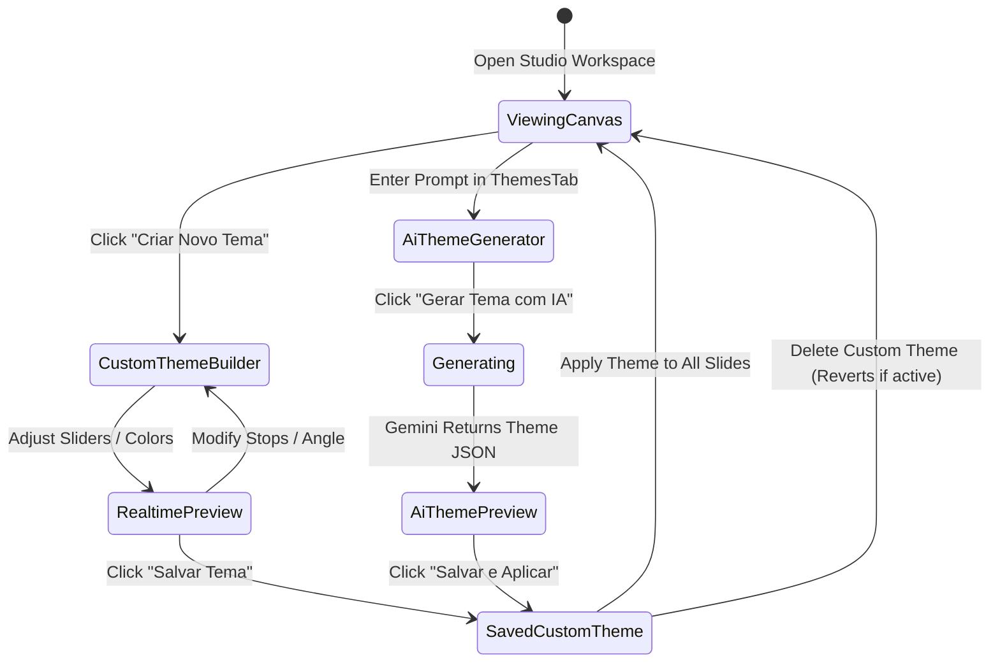

# Data Model: Clean Canvas, Custom Dynamic Themes & Secure Gemini AI Integration

**Feature**: `004-custom-themes-gemini`
**Status**: Ready for Implementation

---

## 1. Entity Definitions

### 1.1 `CustomTheme`
Represents an author-created or AI-generated visual color theme.

```typescript
interface GradientStop {
  color: string;     // Hex color (e.g., "#00A3FF")
  position: number;  // 0 to 100 percentage
  opacity?: number;  // 0.0 to 1.0
}

interface GradientConfig {
  type: 'linear' | 'radial';
  angle: number;     // 0 to 360 degrees (for linear)
  stops: GradientStop[];
}

interface CustomTheme {
  id: string;                    // Unique identifier: "custom-theme-{timestamp}"
  name: string;                  // User or AI-defined title (e.g., "Cyberpunk Neon")
  category: 'custom';            // Fixed category for filtering
  preview: string;               // Primary hex color for swatch circles
  isCustom: true;                // Flag separating from built-in themes
  bg: string;                    // CSS color or gradient expression (e.g., "linear-gradient(...)")
  heading: string;               // Main headline text color
  accent: string;                // Badges, buttons, highlights color
  text: string;                  // Body text color
  subtext: string;               // Subordinate text color
  gradientConfig?: GradientConfig; // Optional breakdown for re-editing in builder
  createdAt: number;             // Epoch milliseconds
}
```

### 1.2 `AiConfig`
Represents local AI credentials and configuration.

```typescript
interface AiConfig {
  apiKey: string;      // Gemini API key (stored in IndexedDB)
  isConfigured: boolean;
  lastUsed?: number;
}
```

### 1.3 `WorkspaceState` (Extended Schema)

```typescript
interface WorkspaceState {
  id: string;
  title: string;
  rawScript: string;
  activeSlideId: string | null;
  globalFont: string;
  currentTheme: string;          // Native theme id OR CustomTheme id
  customThemes: CustomTheme[];   // Array of persisted user/AI themes
  apiKey?: string;               // Optional synchronized Gemini API key
  isLeftSidebarOpen: boolean;
  isRightSidebarOpen: boolean;
  profile: CreatorProfile;
  slides: Slide[];
  lastModified: number;
}
```

---

## 2. Storage & Persistence Schema

IndexedDB store keys via `storageService.js`:
- `carousel-active-workspace`: Full `WorkspaceState` including `customThemes`.
- `carousel-custom-themes`: Standalone list of `CustomTheme[]` to share across multiple projects.
- `gemini-api-key`: Persisted API key string.

---

## 3. State Transitions & Lifecycle


