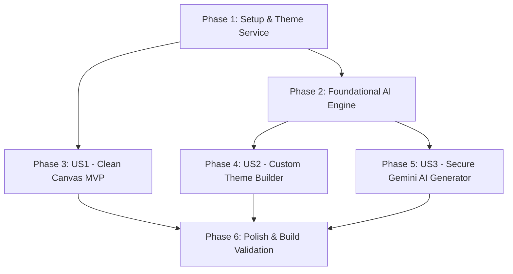

# Tasks: Clean Canvas, Custom Dynamic Themes & Secure Gemini AI Integration

**Input**: Design documents from `specs/004-custom-themes-gemini/`
**Prerequisites**: [plan.md](file:///D:/Carrosseis-Generator/specs/004-custom-themes-gemini/plan.md), [spec.md](file:///D:/Carrosseis-Generator/specs/004-custom-themes-gemini/spec.md), [research.md](file:///D:/Carrosseis-Generator/specs/004-custom-themes-gemini/research.md), [data-model.md](file:///D:/Carrosseis-Generator/specs/004-custom-themes-gemini/data-model.md), [contracts/](file:///D:/Carrosseis-Generator/specs/004-custom-themes-gemini/contracts/)

## Format: `- [ ] [TaskID] [P?] [Story?] Description with file path`

- **[P]**: Can run in parallel (different files, no dependencies)
- **[Story]**: Which user story this task belongs to ([US1], [US2], [US3])
- Strict file paths included in all descriptions

---

## Phase 1: Setup (Infrastructure & Services Initialization)

**Purpose**: Theme calculation helpers, storage extensions, and CSS variable styling

- [ ] T001 Create pure functional theme helper service in `src/services/themeService.js` (`resolveThemeVariables`, `createCustomTheme`, `generateGradientCss`, `calculateContrastRatio`)
- [ ] T002 [P] Extend IndexedDB persistence in `src/services/storageService.js` to store and retrieve `customThemes` and masked `geminiApiKey`
- [ ] T003 [P] Configure CSS utility classes for theme cards, gradient preview boxes, and color input sliders in `src/styles/workspace.css`

---

## Phase 2: Foundational (Blocking Services & AI Integration Engine)

**Purpose**: Gemini AI REST client and constant definitions

**⚠️ CRITICAL**: Must be completed before User Story 2 & 3 UI components begin

- [ ] T004 Implement `generateThemeFromPrompt` in `src/services/aiService.js` with structured Gemini 2.5 Flash REST API prompt and contrast verification
- [ ] T005 [P] Update `src/services/workspaceConstants.js` to support dynamic theme categories and fallback color palettes

**Checkpoint**: Foundation ready - user story implementation can begin independently

---

## Phase 3: User Story 1 - Clean Canvas (Removal of Slide Labels) (Priority: P1) 🎯 MVP

**Goal**: Eliminar a tag interna de nomenclatura ("Capa", "Slide N", "Fechamento") de dentro dos cards de slide para que a visualização seja limpa e livre de elementos ruidosos.

**Independent Test**: Abrir qualquer carrossel e verificar visualmente que a tag interna de texto foi removida dos slides, mantendo apenas título, subtexto, mídias e assinatura.

### Implementation for User Story 1

- [ ] T006 [P] [US1] Remove internal `
` and `getBadgeLabel` rendering from `src/components/SlideCard.jsx`
- [ ] T007 [US1] Clean up obsolete `.slide-tag` CSS rules and adjust top padding in `src/styles/workspace.css`
- [ ] T008 [US1] Verify clean canvas presentation in `src/components/SlidesCanvas.jsx` and export rendering in `src/components/ExportToolbar.jsx`

**Checkpoint**: User Story 1 delivers an immediate uncluttered canvas MVP.

---

## Phase 4: User Story 2 - Dynamic Custom Themes & Advanced Gradient Builder (Priority: P1)

**Goal**: Criador pode conceber e gerenciar seus próprios temas com gradientes avançados (ângulo, stops e opacidade) ou cores sólidas, aplicando-os instantaneamente aos slides.

**Independent Test**: Na aba "Cores", clicar em "Criar Novo Tema", configurar um gradiente angular de 2 stops, salvar e verificar a aplicação instantânea das variáveis CSS a todos os slides e sua persistência após F5.

### Implementation for User Story 2

- [ ] T009 [P] [US2] Create visual theme builder component in `src/components/LeftSidebar/CustomThemeBuilder.jsx` with solid color and multi-stop gradient controls
- [ ] T010 [US2] Integrate custom themes catalog (listing, active indicator, creation trigger, and deletion) into `src/components/LeftSidebar/ThemesTab.jsx`
- [ ] T011 [US2] Wire `customThemes` state, creation handler, and deletion fallback in `src/components/StudioWorkspace.jsx`
- [ ] T012 [US2] Apply dynamic CSS custom properties (`--slide-bg`, `--slide-heading`, `--slide-accent`, `--slide-text`, `--slide-subtext`) to canvas containers in `src/components/SlidesCanvas.jsx` and `src/components/StudioWorkspace.jsx`
- [ ] T013 [US2] Ensure safe fallback to default theme (*Abyssal Glow*) if an active custom theme is deleted in `src/components/StudioWorkspace.jsx`

**Checkpoint**: User Story 2 provides infinite creative freedom with real-time theme reactivity.

---

## Phase 5: User Story 3 - Secure Gemini AI Integration & AI Theme Generator (Priority: P1)

**Goal**: Criador gerencia sua chave da API Gemini em campo mascarado e seguro, e pode gerar paletas completas com título criativo e harmonia cromática via IA com 1 clique.

**Independent Test**: Na aba "Cores", digitar uma descrição de tema (ex: "Tecnologia minimalista azul e grafite"), clicar em "Gerar Tema com IA", pré-visualizar a paleta gerada e salvá-la nos temas personalizados.

### Implementation for User Story 3

- [ ] T014 [P] [US3] Update Gemini API key input in `src/components/ScriptInputView.jsx` with password masking, visibility toggle (`Eye`/`EyeOff`), and IndexedDB persistence
- [ ] T015 [US3] Add masked Gemini API key management section with toggle visibility and connection badge in `src/components/LeftSidebar/ThemesTab.jsx`
- [ ] T016 [US3] Add "Gerador de Temas por IA" prompt input and generation button in `src/components/LeftSidebar/ThemesTab.jsx`
- [ ] T017 [US3] Connect AI generation handler in `ThemesTab.jsx` to `aiService.generateThemeFromPrompt`, displaying palette preview with creative title and "Salvar e Aplicar"
- [ ] T018 [US3] Synchronize API key state between landing view (`ScriptInputView.jsx`) and studio workspace (`StudioWorkspace.jsx`) via `storageService.js`

**Checkpoint**: User Story 3 delivers practical, secure AI superpowers directly in the studio.

---

## Phase 6: Polish & Cross-Cutting Concerns

**Purpose**: Production build validation, E2E scenarios, and documentation

- [ ] T019 [P] Verify production build and asset bundling via `cmd /c "npm run build"`
- [ ] T020 Execute all 5 validation scenarios defined in `specs/004-custom-themes-gemini/quickstart.md`
- [ ] T021 Code cleanup, comment integrity check, and documentation synchronization

---

## Dependencies & Execution Order

### Phase Dependencies

### User Story Dependencies

- **User Story 1 (P1)**: Independent of AI and Custom Themes. Can be implemented and verified immediately as MVP.
- **User Story 2 (P1)**: Depends on `themeService.js` (Phase 1) and `storageService.js`.
- **User Story 3 (P1)**: Depends on `aiService.js` (Phase 2) and integrates with User Story 2 custom theme catalog.

---

## Implementation Strategy

### MVP First (User Story 1 Focus)
1. Complete **Phase 1** (Theme Service & Storage: T001-T003).
2. Complete **Phase 3** (Clean Canvas: T006-T008).
3. **VALIDATE MVP**: Verify that slide labels are gone and the canvas is clean.

### Incremental Delivery
4. Complete **Phase 2** (Foundational AI: T004-T005).
5. Implement **Phase 4** (Custom Theme Builder & Gradient Engine: T009-T013).
6. Implement **Phase 5** (Secure Gemini AI & Prompt Theme Generator: T014-T018).
7. Execute **Phase 6** (Build Verification & E2E Validation: T019-T021).
