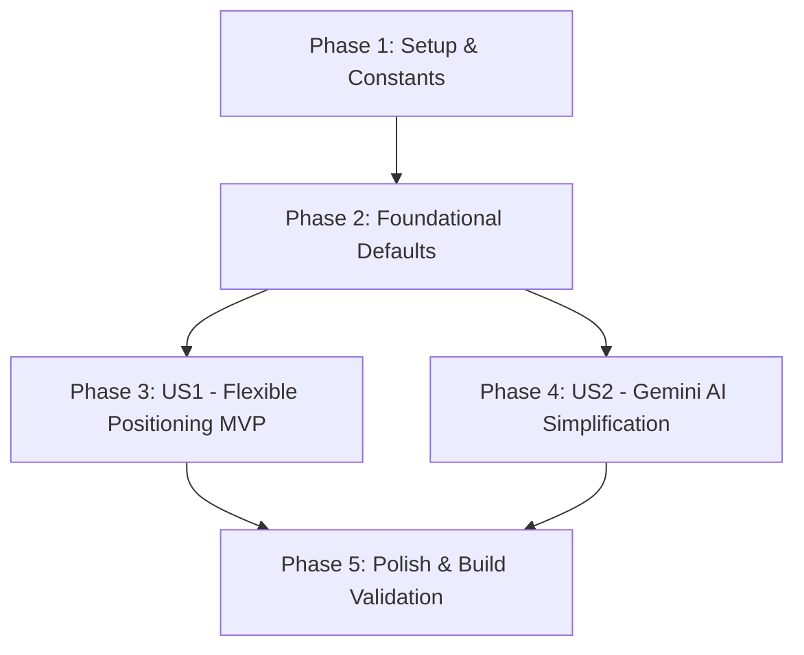

# Tasks: Flexible Profile Positioning & Gemini AI Simplification

**Input**: Design documents from `specs/005-flexible-profile-positioning/`
**Prerequisites**: [plan.md](file:///D:/Carrosseis-Generator/specs/005-flexible-profile-positioning/plan.md), [spec.md](file:///D:/Carrosseis-Generator/specs/005-flexible-profile-positioning/spec.md), [research.md](file:///D:/Carrosseis-Generator/specs/005-flexible-profile-positioning/research.md), [data-model.md](file:///D:/Carrosseis-Generator/specs/005-flexible-profile-positioning/data-model.md), [contracts/](file:///D:/Carrosseis-Generator/specs/005-flexible-profile-positioning/contracts/)

## Format: `- [ ] [TaskID] [P?] [Story?] Description with file path`

- **[P]**: Can run in parallel (different files, no dependencies)
- **[Story]**: Which user story this task belongs to ([US1], [US2])
- Strict file paths included in all descriptions

---

## Phase 1: Setup (Infrastructure & Constants)

**Purpose**: Positioning constants, storage defaults, and CSS flexbox styling rules

- [ ] T001 Register `BRANDING_POSITIONS` constant array with 6 strategic anchors in `src/services/workspaceConstants.js`
- [ ] T002 [P] Extend `storageService.getProfile()` and `storageService.getWorkspace()` in `src/services/storageService.js` with default `position: profile?.position || 'bottom-left'`
- [ ] T003 [P] Define `.branding-pos-*` CSS flexbox rules in `src/styles/workspace.css` for the 6 anchors (`top-left`, `top-center`, `top-right`, `bottom-left`, `bottom-center`, `bottom-right`)

---

## Phase 2: Foundational (Blocking Prerequisites)

**Purpose**: Core state defaults ensuring smooth positioning across workspaces

**⚠️ CRITICAL**: Must be completed before User Story UI components begin

- [ ] T004 Update `CreatorProfile` default state in `src/App.jsx` and `src/components/StudioWorkspace.jsx` to initialize `position: 'bottom-left'`

**Checkpoint**: Foundation ready - user story implementation can begin independently

---

## Phase 3: User Story 1 - Flexible Profile Positioning (Priority: P1) 🎯 MVP

**Goal**: Criador pode reposicionar a assinatura de branding entre os 6 cantos e bordas do slide (`top-left`, `top-center`, `top-right`, `bottom-left`, `bottom-center`, `bottom-right`), evitando colisões e flexibilizando a diagramação.

**Independent Test**: Na aba "Perfil", alternar entre as 6 posições e verificar a renderização em tempo real no palco de slides, além de testar a fidelidade no download em PNG.

### Implementation for User Story 1

- [ ] T005 [P] [US1] Build visual 6-point position anchor selector in `src/components/LeftSidebar/BrandingTab.jsx`
- [ ] T006 [US1] Apply dynamic `.branding-pos-${position}` classes to `.slide-branding-bar` in `src/components/SlideCard.jsx`
- [ ] T007 [US1] Ensure non-collision layout between text container and top/bottom branding bars in `src/styles/workspace.css`
- [ ] T008 [US1] Verify high-resolution export rendering with repositioned branding bar in `src/components/ExportToolbar.jsx`

**Checkpoint**: User Story 1 delivers full creative freedom in signature positioning as MVP.

---

## Phase 4: User Story 2 - Gemini AI Simplification: Script Focus & Masked Key (Priority: P1)

**Goal**: Remover o gerador de temas por IA da aba "Cores" mantendo o criador manual limpo, e consolidar o gerenciamento da chave da API do Gemini mascarada para uso focado na síntese de roteiros.

**Independent Test**: Na aba "Cores", verificar ausência da seção de temas com IA; no editor de roteiro e tela inicial, verificar chave mascarada e geração funcional de slides com IA ou algoritmo local.

### Implementation for User Story 2

- [ ] T009 [P] [US2] Remove AI theme generator prompt, button, and preview cards from `src/components/LeftSidebar/ThemesTab.jsx`
- [ ] T010 [US2] Clean up `src/components/LeftSidebar/LeftSidebar.jsx` and `src/components/StudioWorkspace.jsx` to streamline `ThemesTab.jsx` props
- [ ] T011 [US2] Add masked Gemini API key configuration section in `src/components/RightSidebar/RightSidebar.jsx` with `Eye`/`EyeOff` toggle and IndexedDB persistence for script regeneration
- [ ] T012 [US2] Connect `workspaceService.regenerateSlidesFromRawScript` with API key support in `src/components/StudioWorkspace.jsx` and `src/components/RightSidebar/RightSidebar.jsx`

**Checkpoint**: User Story 2 simplifies the studio interface while securing and focusing Gemini AI capabilities on script structuring.

---

## Phase 5: Polish & Cross-Cutting Concerns

**Purpose**: Production build verification, E2E validation scenarios, and documentation

- [ ] T013 [P] Verify production build and asset bundling via `cmd /c "npm run build"`
- [ ] T014 Execute all 5 validation scenarios defined in `specs/005-flexible-profile-positioning/quickstart.md`
- [ ] T015 Code cleanup, comment integrity check, and documentation synchronization

---

## Dependencies & Execution Order

### User Story Dependencies

- **User Story 1 (P1)**: Depends on Phase 1 & 2 (positioning constants, CSS rules, storage defaults). Delivers the primary visual enhancement.
- **User Story 2 (P1)**: Can be implemented concurrently or following User Story 1. Cleans up the "Cores" tab and adds masked API key support to the script editor.

---

## Implementation Strategy

### MVP First (User Story 1 Focus)
1. Complete **Phase 1** (T001-T003) & **Phase 2** (T004).
2. Complete **Phase 3** (T005-T008).
3. **VALIDATE MVP**: Verify profile moves cleanly to all 6 positions on the canvas and in export.

### Incremental Delivery
4. Complete **Phase 4** (T009-T012): Remove AI theme generator and polish script key management.
5. Complete **Phase 5** (T013-T015): Run production build and quickstart validation scenarios.
